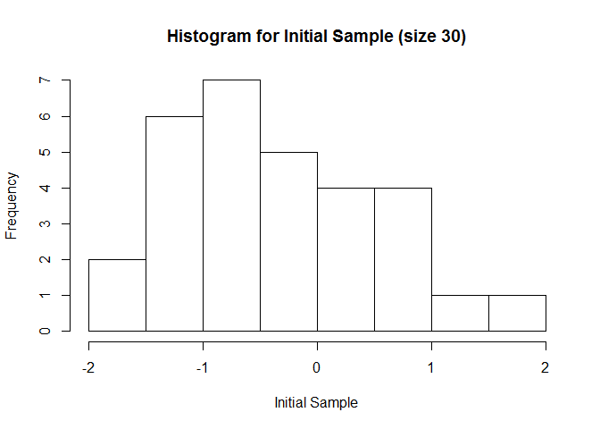
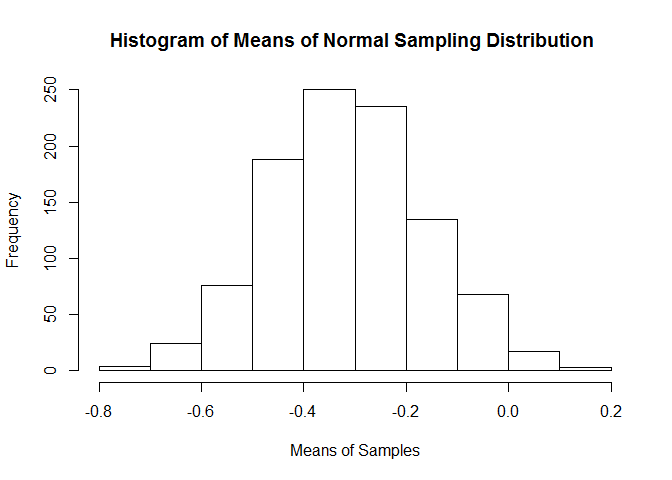
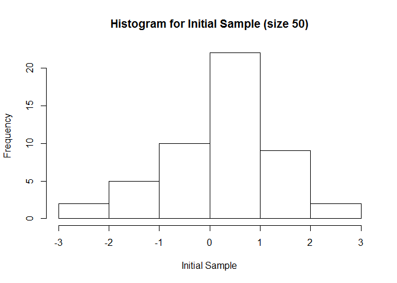
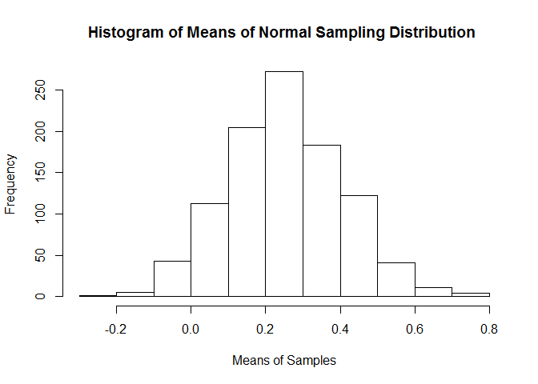
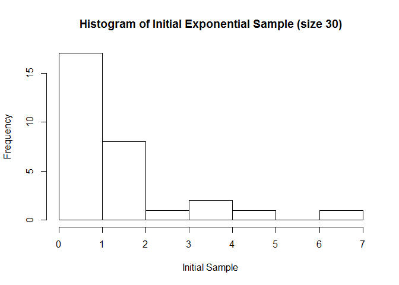
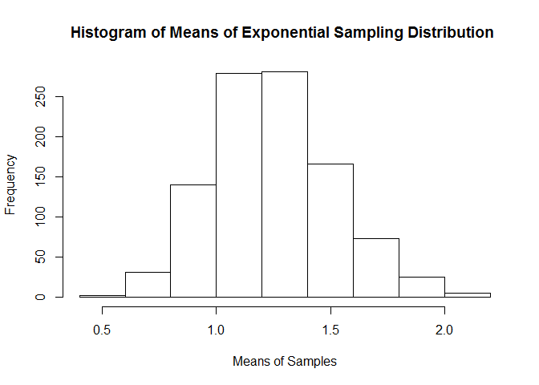
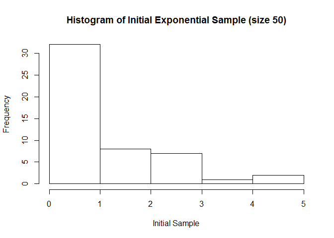
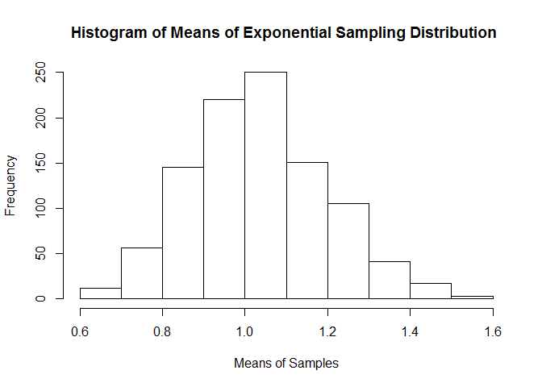

# BootStrap illustration of Central Limit Theorem
VAhir  
June 5, 2016  

# Central Limit Theorem  
**We will try and illustrate central limit theorem principles here.**  
* Given that a certain population does not have a normal distribution, when a sample is taken from such a population and mean is calculated for such a sample lets say 1000 times, the distribution of mean of such a sample distribution will mostly have Normal distribution.  
* The standard deviation of sampling distribution of sample means is smaller than standarad deviation of original sample standar deviation.  
* Sample size should be big enough to allow the mean distribution to be normal. Ideal value ~30.  
  
  
## Using a normal distribution sample
  
Lets take a sample of 30 using random normal distribution function.
We will record mean of this sample in m_sample1 variable and standard deviatio in sd_sample1.


```r
set.seed(6516)
sample1 <- rnorm(30)
m_sample1 <- mean(sample1)
sd_sample1 <- sd(sample1)
```

Here if we take a historgram of the current sample, we may not necessarily get a normal distribution.


```r
hist(sample1, main="Histogram for Initial Sample (size 30)", xlab = "Initial Sample")
```

<!-- -->

However, using bootstrap, if we take 1000 random samples from this same "sample1" with replace option as 'TRUE' and take mean of all of these 1000 random samples, the distribution of those means will turn out to be normally distributed. Lets try that.


```r
reps <- 1000
bootsample <- numeric(reps)

for (i in 1:reps) { 
temp_sample <- sample(sample1, size=length(sample1), replace =TRUE)
bootsample[i] <- mean(temp_sample)
}

m_bootsample <- mean(bootsample)
sd_bootsample_30 <- sd_sample1/sqrt(30)

m_sample1
```

```
## [1] -0.3079929
```

```r
m_bootsample
```

```
## [1] -0.3142877
```

```r
sd_sample1
```

```
## [1] 0.8533635
```

```r
sd_bootsample_30
```

```
## [1] 0.1558021
```
Above we can see that standard error gets smaller as sample size increases. We can calculate standard error by dividing standard deviation of original sample by square root of sample size.  
  
Now if we take a histogram of all these 1000 samples of means, we should get a normal distribution.


```r
hist(bootsample, main="Histogram of Means of Normal Sampling Distribution ", xlab="Means of Samples")
```

<!-- -->

Now we will repeat the same process with a bigger sample size - lets say 50.


```r
set.seed(65162)
sample2 <- rnorm(50)
m_sample2 <- mean(sample2)
sd_sample2 <- sd(sample2)

for(i in 1:reps) { temp_sample <- sample(sample2, size=length(sample2), replace =TRUE)
bootsample[i] <- mean(temp_sample)
}

m_bootsample <- mean(bootsample)
sd_bootsample_50 <- sd_sample2/sqrt(50)

m_sample2
```

```
## [1] 0.2527605
```

```r
sd_sample2
```

```
## [1] 1.075468
```

```r
m_bootsample
```

```
## [1] 0.2542408
```

```r
sd_bootsample_30
```

```
## [1] 0.1558021
```

```r
sd_bootsample_50
```

```
## [1] 0.1520942
```

```r
hist(sample2, main="Histogram for Initial Sample (size 50)", xlab = "Initial Sample") 
```

<!-- -->

```r
hist(bootsample, main="Histogram of Means of Normal Sampling Distribution ", xlab="Means of Samples")
```

<!-- -->
  
  We can see in results that the standard error reduces when the sample size increases however the mean remains more or less the same as original sample mean.  
  
  
## Using a exponential distribution sample
  
  We are going to repeat the sample experiment of using boot strap mechanism to illustrate Central Limit Theorem but this time instead of using a random normal sample, we will use random exponential samples. We will take 2 samples of sizes 30 and 50.
  
**Sample Size 30 - Exponential**  
    

```r
  set.seed(65163)
  sample1 <- rexp(30)
  m_sample1 <- mean(sample1)
  sd_sample1 <- sd(sample1)
  
  for (i in 1:reps) { 
temp_sample <- sample(sample1, size=length(sample1), replace =TRUE)
bootsample[i] <- mean(temp_sample)
}

m_bootsample <- mean(bootsample)
sd_bootsample_30 <- sd_sample1/sqrt(30)

m_sample1
```

```
## [1] 1.251547
```

```r
m_bootsample
```

```
## [1] 1.250498
```

```r
sd_sample1
```

```
## [1] 1.473865
```

```r
sd_bootsample_30
```

```
## [1] 0.2690897
```

```r
hist(sample1, main="Histogram of Initial Exponential Sample (size 30)", xlab = "Initial Sample")
```

<!-- -->

```r
hist(bootsample, main="Histogram of Means of Exponential Sampling Distribution ", xlab="Means of Samples")
```

<!-- -->


**Sample Size 50 - Exponential**

```r
  set.seed(65164)
  sample1 <- rexp(50)
  m_sample1 <- mean(sample1)
  sd_sample1 <- sd(sample1)
  
  for (i in 1:reps) { 
temp_sample <- sample(sample1, size=length(sample1), replace =TRUE)
bootsample[i] <- mean(temp_sample)
}

m_bootsample <- mean(bootsample)
sd_bootsample_50 <- sd_sample1/sqrt(50)

m_sample1
```

```
## [1] 1.032772
```

```r
m_bootsample
```

```
## [1] 1.034289
```

```r
sd_sample1
```

```
## [1] 1.150919
```

```r
sd_bootsample_30
```

```
## [1] 0.2690897
```

```r
sd_bootsample_50
```

```
## [1] 0.1627645
```

```r
hist(sample1, main="Histogram of Initial Exponential Sample (size 50)", xlab = "Initial Sample")
```

<!-- -->

```r
hist(bootsample, main="Histogram of Means of Exponential Sampling Distribution ", xlab="Means of Samples")
```

<!-- -->

Above we can see that standard error gets smaller as sample size increases. We can calculate standard error by dividing standard deviation of original sample by square root of sample size. 
  
